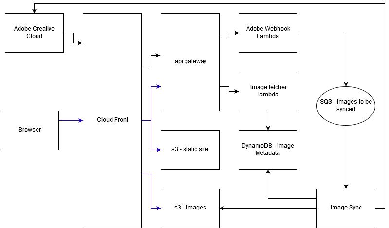

Off the cob - aws edition
=============
This project is the millionth iteration of the image gallery that I've
built over and over to try to learn new technologies. This
iteration I'm exploring the aws serverless architecture.

As I was exploring the adobe creative cloud sdk, it found that there is
a way to receive events through webhooks about state that 
changes in the system. I'm interested in this because I use lightroom cc to 
manage my photography. Lightroom cc is a new offering from adobe that stores
images in their cloud service. Their tools are pretty great, syncing my photography
with my mobile devices.

# Architecture
This project is built with the following technologies:
* Python
* React.js
* SQS (amazon message queues)
* Aws Lambda
* Hashicorp Terraform



### The data flow of the system:
1. Adobe calls the lambda webhook
1. The webhook chunks the list of images into individual messages per image an puts them onto SQS
1. The image sync lambda fetches an image, puts it into s3, and adds metadata to dynamodb

### The browser flow of the system:
1. Static site is loaded from s3 (html, js, css)
1. JS calls api gateway to fetch image metadata
1. Image fetcher looks up the image in dynamodb, and returns the s3 image location
1. Images are displayed in the browser

# Development
* Build the lambdas
```bash
make build
```

* Run the terraform plan - note you will need to override or set some of the variables
in variables.tf as command line environment variables. 
```bash
export AWS_ACCESS_KEY_ID=YOUR_AWS_ACCESS_KEY
export AWS_SECRET_ACCESS_KEY=YOUR_SECRET_KEY
make plan
```

* To store state in s3 add the following ignored file, `terraform_backend.tf` to the terraform directory,
with the following configuration. Note that this is a chicken and egg problem, the s3 bucket needs
to be manually created outside of the scope of terraform. Make sure you secure this bucket before
adding state to it.
```
terraform {
  backend "s3" {
    bucket = "YOUR_BUCKET_NAME"
    key    = "otc/terraform.tfstate"
    region = "us-west-2"
  }
}

data "terraform_remote_state" "otc" {
  backend = "s3"
  config {
    bucket = "YOUR_BUCKET_NAME"
    key    = "otc/terraform.tfstate"
    region = "us-west-2"
  }
}
```

* To deploy to production do the following. Please make sure you run the plan first, and verify that it is doing
what you expect.
```bash
make deploy
```
